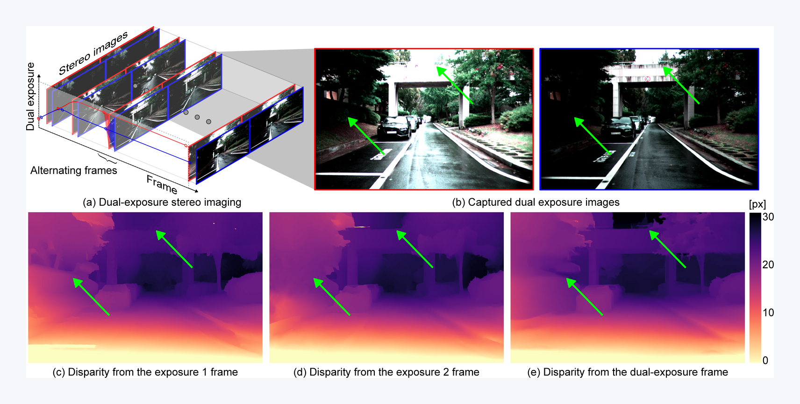

<h1 align="center">Dual Exposure Stereo for Extended Dynamic Range 3D Imaging (CVPR 2025)</h1>


<p align="center">
  <a href="https://light.princeton.edu/publication/dual-exposure-stereo/"><strong>Project Page</strong></a> •
  <a href="https://openaccess.thecvf.com/content/CVPR2025/papers/Choi_Dual_Exposure_Stereo_for_Extended_Dynamic_Range_3D_Imaging_CVPR_2025_paper.pdf"><strong>Paper</strong></a> •
  <a href="https://cinescope-wkr.github.io/dual-exposure-stereo/"><strong>Documentation</strong></a>
</p>

<p align="center">
  <a href="#overview">Overview</a> •
  <a href="#documentation">Documentation</a> •
  <a href="#getting-started">Getting Started</a> •
  <a href="#method-overview">Method Overview</a> •
  <a href="#repository-guide">Repository Guide</a> •
  <a href="#data-and-checkpoints">Data and Checkpoints</a> •
  <a href="#reproducibility">Reproducibility</a> •
  <a href="#citation">Citation</a>
</p>

<p align="center">
  <a href="paper/teaser.pdf">
    
  </a>
</p>

<p align="center">
  <em>Dual-exposure stereo aligns and fuses complementary bright and dark observations to preserve disparity cues and improve 3D imaging robustness under adverse lighting conditions.</em>
</p>

---

## Overview

This repository is the research-code for the CVPR 2025 paper
`Dual Exposure Stereo for Extended Dynamic Range 3D Imaging`.

The core idea is to improve stereo 3D imaging in challenging lighting conditions
by combining:

- automatic dual exposure control (`ADEC`)
- alternating dual-exposure stereo capture
- motion-aware cross-frame fusion before disparity estimation

> [!NOTE]
> The repository is public, but the **full dataset release** and **pretrained checkpoints**
> are currently being reorganized. This means the repository should presently be read as a
> documented research code release with validators, paper-to-code mapping, and runnable
> entry points, while the public asset packaging, related dataset-generation code, and
> ongoing dataset sanity and volume preparation work are being cleaned up and will be
> updated again soon.
>
> Maintainer: **[Jinwoo Lee](cinescope-wkr.github.io) (cinescope@kaist.ac.kr)**

---

## Documentation

Paper-to-code documentation is available at:

- <https://cinescope-wkr.github.io/dual-exposure-stereo/>

Local preview:

```bash
make docs-serve
```

---

## Getting Started

Install the main runtime dependencies first:

```bash
pip install -r requirements.txt
```

Then start with the shipped validation tools:

```bash
python tools/validate_paper_repro.py
python tools/validate_dual_exposure_logic.py
python -m unittest discover -s test -p 'test_dual_exposure_logic.py' -v
```

These are the best first checks because they do not require the full paper-scale
datasets or released checkpoints.

---

## Method Overview

The repository implements the paper through five connected stages:

1. `ADEC` adjusts a stereo exposure pair instead of a single exposure.
2. HDR scene radiance is mapped into captured LDR images through the image-formation model.
3. Alternating frames provide complementary bright and dark observations.
4. Motion compensation aligns the second exposure before feature fusion.
5. The fused representation is used for stereo disparity estimation.

In practical terms, the method is trying to preserve useful depth cues in both
highlight-heavy and shadow-heavy regions where single-exposure stereo can fail.

---

## Repository Guide

```text
core/
  adec.py                         Rule-based auto dual exposure control
  combine_model_dual.py           End-to-end dual-exposure stereo wrapper
  disp_recon_model_dual.py        Dual-exposure stereo disparity model
  disp_recon_model_dual_finetune.py
                                  Finetuning variant
  stereo_datasets.py              Synthetic CARLA dataset loader
  real_datasets_lidar.py          Real stereo + LiDAR dataset loader
  utils/
paper/
tools/
test/
```

Main runnable paths:

1. Synthetic training via `train_disp_recon_dual.py`
2. Synthetic sequence evaluation via `test_sequence_carla.py`
3. Real sequence evaluation via `test_sequence_real.py`

Paper-facing and validation-facing utilities:

- `tools/validate_paper_repro.py`
- `tools/validate_dual_exposure_logic.py`
- `tools/reproduce_table1.py`
- `tools/reproduce_table2.py`

---

## Data and Checkpoints

### Synthetic CARLA

Expected layout:

```text
datasets/
└── CARLA/
    ├── training/
    │   └── Experiment*/
    │       ├── ground_truth_depth_left/
    │       ├── ground_truth_depth_right/
    │       ├── ground_truth_disparity_left/
    │       ├── ground_truth_disparity_right/
    │       ├── hdr_left/
    │       ├── hdr_right/
    │       ├── calibration_file_extrinsic_left.npy
    │       ├── calibration_file_extrinsic_right.npy
    │       └── calibration_file_intrinsic.npy
    └── test/
        └── Experiment*/
```

### Real Stereo + LiDAR

Expected layout:

```text
datasets/
├── Real/
│   └── <date>/<time>/
│       ├── left.npy
│       ├── right.npy
│       └── points.npy
└── camera_params/
    └── post.npz
```

### Current Status

- the repository does **not** currently bundle the full paper-scale datasets
- the repository does **not** currently bundle the pretrained checkpoints referenced by the scripts
- the dataset and checkpoint packaging, along with related dataset-generation code, is being reorganized and will be updated again

Documented example checkpoint paths still used by the scripts include:

- `models/raftstereo-eth3d.pth`
- `checkpoints/10000_disp_gru_eth3d_blur_gmflow_iter20.pth`
- `checkpoints/5000_disp_fusion_mask_finetuned_gru.pth`

---

## Reproducibility

### What Can Be Validated Today

This repository already supports:

- static repository validation
- mock-scene validation of key dual-exposure logic
- unit-test coverage for the new mock validation path
- paper-facing benchmark entry points for supported rows

### Lightweight Functional Validation

Run:

```bash
python tools/validate_dual_exposure_logic.py
```

This validator checks:

- complementary valid coverage across two exposures
- ADEC exposure-gap expansion
- disparity improvement from dual-exposure fusion
- temporal alignment gain from motion compensation

### Unit Tests

Run:

```bash
python -m unittest discover -s test -p 'test_dual_exposure_logic.py' -v
```

### Paper-Facing Benchmark Runners

```bash
python tools/reproduce_table1.py --output_json results/table1.json
python tools/reproduce_table2.py --output_json results/table2_supported.json
```

For a more detailed audit of what is already aligned, what was fixed locally,
and what still blocks full paper-scale reproduction, see `PAPER_REPRODUCIBILITY.md`.

---

## Paper-to-Code Map

- ADEC controller: `core/adec.py`
- Image formation model: `core/utils/simulate.py`
- Dual-exposure feature fusion and motion compensation: `core/disp_recon_model_dual.py`
- Finetuning variant: `core/disp_recon_model_dual_finetune.py`
- End-to-end wrapper: `core/combine_model_dual.py`
- Synthetic loader: `core/stereo_datasets.py`
- Real stereo-plus-LiDAR loader: `core/real_datasets_lidar.py`

---

## Citation

Machine-readable citation metadata is available in `CITATION.cff`.

```bibtex
@inproceedings{choi2025dual,
  title={Dual Exposure Stereo for Extended Dynamic Range 3D Imaging},
  author={Choi, Juhyung and Kim, Jinnyeong and Choi, Seokjun and Lee, Jinwoo and Brucker, Samuel and Bijelic, Mario and Heide, Felix and Baek, Seung-Hwan},
  booktitle={Proceedings of the IEEE/CVF Conference on Computer Vision and Pattern Recognition (CVPR)},
  pages={6283--6290},
  year={2025}
}
```
